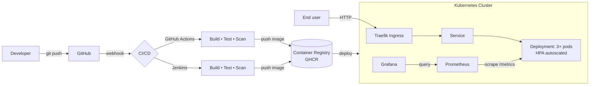

# devops-showcase

A small but **production-grade** Go microservice built to demonstrate a complete,
end-to-end DevOps workflow: **Docker → Kubernetes → CI/CD (Jenkins + GitHub
Actions) → Observability (Prometheus + Grafana) → Traffic routing (Traefik)**.

It is intentionally compact so you can read every file in one sitting, yet it
applies the patterns you would defend in a senior/staff interview: multi-stage
distroless images, non-root hardened pods, health/readiness probes, graceful
shutdown, RED-method metrics, autoscaling, and a real deploy pipeline.

> **📚 Start here for the interview:**
> - [`docs/SPEC.md`](docs/SPEC.md) — the full spec/design doc + a **10-minute
>   walkthrough script** you can present.
> - [`docs/TEST-REPORT.md`](docs/TEST-REPORT.md) — every test, how to run it,
>   and what passing looks like.
> - [`docs/PRODUCTION-READINESS.md`](docs/PRODUCTION-READINESS.md) — an
>   auditable production-readiness checklist.

---

## Table of contents

- [Architecture](#architecture)
- [End-to-end flow](#end-to-end-flow)
- [The application](#the-application)
- [Quickstart: run the full stack locally](#quickstart-run-the-full-stack-locally)
- [Docker: how the image is built](#docker-how-the-image-is-built)
- [Kubernetes deployment](#kubernetes-deployment)
- [CI/CD pipelines](#cicd-pipelines)
- [Observability](#observability)
- [Repository layout](#repository-layout)
- [Interview talking points](#interview-talking-points)

---

## Architecture



## End-to-end flow

1. **Code** — a Go HTTP service (`cmd/server`) exposes a small API plus
   `/healthz`, `/readyz`, and `/metrics`.
2. **Commit & push** — you push to GitHub.
3. **CI** — GitHub Actions *and* a Jenkins pipeline run the same stages:
   `go vet` → `golangci-lint` → `go test -race` → build a **multi-stage
   distroless** image → **Trivy** vulnerability scan → push to the registry.
4. **Deploy** — the image is rolled out to Kubernetes via **kustomize**
   overlays (staging/production) with a zero-downtime rolling update.
5. **Serve traffic** — **Traefik** routes external traffic to the Service,
   which load-balances across the autoscaled pods.
6. **Observe** — **Prometheus** scrapes `/metrics`; **Grafana** visualises
   request rate, error rate, and latency (the RED method); alert rules fire on
   downtime, high error rate, or high p95 latency.

## The application

A dependency-free Go 1.23 service (stdlib only) — which keeps the image tiny,
the build reproducible, and the attack surface minimal.

| Endpoint          | Purpose                                                        |
| ----------------- | -------------------------------------------------------------- |
| `GET /`           | Service metadata + build info                                  |
| `GET /healthz`    | **Liveness** probe (process is up)                             |
| `GET /readyz`     | **Readiness** probe (safe to receive traffic)                  |
| `GET /metrics`    | Prometheus exposition format                                   |
| `GET /api/hello`  | Simple JSON greeting (`?name=`)                                |
| `GET /api/work`   | Variable-latency endpoint (populates the latency histogram)    |
| `GET /api/error`  | Fails ~30% of the time (demonstrates error-rate alerting)      |

Production patterns implemented:

- **12-factor config** via environment variables (`internal/config`).
- **Structured JSON logging** with `log/slog`.
- **Graceful shutdown**: on `SIGTERM` it fails readiness first (so load
  balancers stop sending traffic), then drains in-flight requests.
- **Build metadata** (`version/commit/build date`) injected via `-ldflags` and
  surfaced in `/`, `/metrics`, and `--version`.
- **RED metrics**: Rate, Errors, Duration — as counters and a histogram.

## Quickstart: run the full stack locally

**Prerequisites:** Docker + Docker Compose. (Go is *not* required to run it.)

```bash
# Bring up app + Traefik + Prometheus + Grafana
make up          # or: docker compose up --build

# In another terminal, generate traffic
make smoke       # or: ./scripts/smoke-test.sh
```

Then open:

| Service           | URL                              | Notes            |
| ----------------- | -------------------------------- | ---------------- |
| App (via Traefik) | http://app.localhost             |                  |
| Traefik dashboard | http://localhost:8090            |                  |
| Prometheus        | http://localhost:9090            | try `/targets`   |
| Grafana           | http://localhost:3000            | `admin` / `admin`|

In Grafana the **"devops-showcase / Application"** dashboard is auto-provisioned.

Tear down with `make down`.

## Docker: how the image is built

`Dockerfile` uses a two-stage build:

1. **Builder** (`golang:1.23-alpine`) compiles a fully static binary
   (`CGO_ENABLED=0`) with `-trimpath` and version `-ldflags`, using BuildKit
   cache mounts for fast rebuilds.
2. **Runtime** (`gcr.io/distroless/static-debian12:nonroot`) contains *only*
   the binary — no shell, no package manager — and runs as a **non-root** user.

```bash
make docker-build           # builds ghcr.io/OWNER/devops-showcase:<version>
docker run -p 8080:8080 ghcr.io/OWNER/devops-showcase:latest
curl localhost:8080/healthz
```

## Kubernetes deployment

Manifests live under `k8s/` and are organised with **kustomize** (a `base` plus
`staging`/`production` overlays).

Highlights (`k8s/base/deployment.yaml`):

- **3 replicas**, rolling update with `maxUnavailable: 0` (zero downtime).
- **Liveness / readiness / startup** probes.
- **Resource requests & limits**.
- Hardened `securityContext`: non-root, read-only root FS, all capabilities
  dropped, `seccomp: RuntimeDefault`; namespace enforces the **restricted** Pod
  Security Standard.
- **Topology spread** across nodes; **PodDisruptionBudget** keeps 2 pods up
  during drains.
- **HPA** scales 3→10 pods on CPU/memory.
- **Traefik `IngressRoute`** (plus a portable `Ingress` alternative).
- **ServiceMonitor** for the Prometheus Operator.

```bash
# Render (no cluster needed):
kubectl kustomize k8s/overlays/production

# Apply to your current context:
kubectl apply -k k8s/overlays/production
kubectl -n devops-showcase rollout status deploy/devops-showcase
```

> Replace `ghcr.io/OWNER/devops-showcase` with your image path — either edit
> `k8s/base/kustomization.yaml` or run
> `kustomize edit set image ghcr.io/OWNER/devops-showcase=<your-image>` in an overlay.

Try it on a laptop with **kind** or **minikube** + Traefik, then add
`127.0.0.1 devops-showcase.local` to `/etc/hosts`.

## CI/CD pipelines

Two equivalent pipelines are provided so you can talk to whichever the
interviewer uses:

### GitHub Actions — `.github/workflows/ci-cd.yaml`
- **test**: `go vet`, `golangci-lint`, `go test -race` + coverage.
- **build**: multi-arch (`amd64`/`arm64`) image via Buildx, pushed to GHCR,
  then **Trivy** scan uploaded to GitHub code scanning.
- **manifests**: `kubectl kustomize` validates both overlays.
- **deploy**: gated on `main` + a `production` environment (stubbed apply step
  ready to wire to your cluster or hand off to Argo CD / Flux).

### Jenkins — `Jenkinsfile`
Declarative pipeline with the same stages: Checkout → Test (in a `golang:1.23`
container) → Build → Trivy scan → Push (on `main`) → Validate manifests →
Deploy (`kubectl apply -k`, then `rollout status`). Uses Jenkins credentials
`registry-credentials` and `kubeconfig`.

## Observability

- **Prometheus** (`deploy/prometheus/`) scrapes the app, Traefik, and itself,
  and loads **alert rules** (`alerts.yml`): `AppInstanceDown`, `HighErrorRate`,
  `HighLatencyP95`.
- **Grafana** (`deploy/grafana/`) is provisioned with the Prometheus datasource
  and the application dashboard automatically.

Example PromQL you can demo:

```promql
# Request rate by path
sum by (path) (rate(http_requests_total[1m]))

# 5xx error ratio
sum(rate(http_requests_total{status=~"5.."}[5m])) / sum(rate(http_requests_total[5m]))

# p95 latency
histogram_quantile(0.95, sum(rate(http_request_duration_seconds_bucket[5m])) by (le))
```

## Repository layout

```
.
├── cmd/server/            # main: config, server, graceful shutdown
├── internal/
│   ├── config/            # env-based configuration
│   ├── handlers/          # HTTP handlers + tests
│   ├── metrics/           # dependency-free Prometheus exposition + tests
│   └── version/           # build metadata (ldflags)
├── deploy/
│   ├── prometheus/        # scrape config + alert rules
│   └── grafana/           # datasource + dashboard provisioning
├── k8s/
│   ├── base/              # deployment, service, hpa, pdb, ingress, servicemonitor
│   └── overlays/          # staging / production (kustomize)
├── .github/workflows/     # GitHub Actions CI/CD
├── scripts/               # local-up + smoke test
├── Dockerfile             # multi-stage distroless build
├── docker-compose.yml     # full local stack
├── Jenkinsfile            # Jenkins declarative pipeline
└── Makefile               # common tasks (make help)
```

## Interview talking points

- **Why distroless + static binary?** No shell/package manager → smaller image,
  fewer CVEs, nothing for an attacker to pivot on.
- **Why `maxUnavailable: 0` + readiness gating on shutdown?** True zero-downtime
  deploys: new pods must pass readiness before old ones drain.
- **RED vs USE:** this service exposes RED (Rate, Errors, Duration) at the app
  layer; node/USE metrics would come from node-exporter/cAdvisor.
- **Why both Jenkins and GitHub Actions?** Shows the concepts are portable; the
  pipeline *stages* matter more than the tool.
- **Scaling story:** HPA on CPU/memory today; the histogram enables scaling on
  latency SLOs (custom metrics adapter) tomorrow.
- **Supply chain:** Trivy scanning + immutable SHA-tagged images; next steps
  would be image signing (cosign) and SBOM generation.

---

### License

MIT — see [LICENSE](LICENSE).
