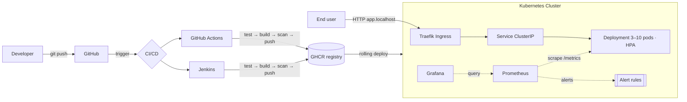
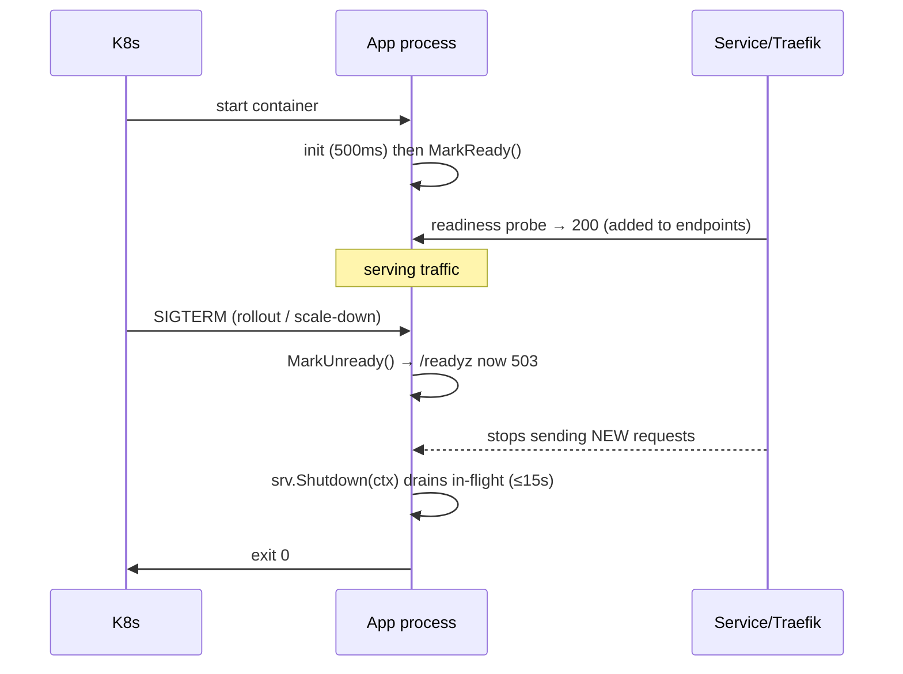

# devops-showcase — Specification & Design Document

> **Read this end-to-end and you can confidently walk an interviewer through the
> whole system for 10–15 minutes.** It explains *what* was built, *why* each tool
> was chosen, *how* the pieces fit together, *what* is tested, and *how* we know
> it is production-ready.

- **Author:** Srikanth Gone
- **Status:** Reference implementation / interview showcase
- **Scope:** A complete, minimal-but-real cloud-native delivery pipeline

---

## 1. Problem statement & use case

Build a small HTTP service and take it **all the way to production the way a
real platform team would** — not just "write an app", but demonstrate the full
software delivery lifecycle:

> A developer pushes code → it is automatically tested, built into a secure
> container, scanned, and published → it is deployed to Kubernetes with zero
> downtime → traffic is routed to it through an ingress → and its health and
> performance are continuously observed with metrics, dashboards, and alerts.

The application itself is deliberately simple so that **the DevOps machinery is
the star of the show**. Every layer is something you can point at and explain.

### Goals
- Show mastery of **Docker, Kubernetes, CI/CD (Jenkins + GitHub Actions),
  Prometheus, Grafana, and Traefik** working together end-to-end.
- Apply **production-grade practices**: security hardening, zero-downtime
  deploys, health probes, autoscaling, observability, and supply-chain scanning.
- Be **runnable locally in one command** and **deployable to any Kubernetes**.

### Non-goals
- A feature-rich business application (the domain logic is intentionally tiny).
- A managed database / stateful storage (kept stateless to focus on delivery).

---

## 2. Architecture



### Request lifecycle (runtime)
1. A request hits **Traefik** (the ingress / reverse proxy) on port 80.
2. Traefik matches the host rule and forwards to the **Service**.
3. The Service load-balances across the healthy **pods** (only pods passing the
   readiness probe receive traffic).
4. Inside the pod, the **metrics middleware** starts a timer and increments the
   in-flight gauge, then calls the handler.
5. The handler responds; the middleware records the request count (by
   method/path/status) and the latency histogram.
6. **Prometheus** scrapes `/metrics` every few seconds; **Grafana** visualises
   it; **alert rules** evaluate continuously.

---

## 3. Component & tooling inventory

| Layer | Tool | Version | Why this tool | Notable alternatives |
| --- | --- | --- | --- | --- |
| Language | **Go** | 1.23 | Fast static binaries, tiny images, first-class concurrency & stdlib HTTP | Node, Java, Python |
| HTTP | Go `net/http` (stdlib) | — | No framework needed; `ServeMux` supports method+path routing since 1.22 | Gin, Echo, Chi |
| Metrics | Custom Prometheus exposition (stdlib) | — | Zero dependencies → smaller image, reproducible offline builds | prometheus/client_golang |
| Logging | `log/slog` (stdlib) | — | Structured JSON logs, standard since Go 1.21 | zap, zerolog |
| Container | **Docker** (multi-stage) | BuildKit | Reproducible builds, layer caching | Buildah, ko |
| Base image | **distroless static** `nonroot` | debian12 | No shell/package manager → minimal CVEs & attack surface | alpine, scratch |
| Orchestration | **Kubernetes** | 1.27+ | Industry standard for rollout, scaling, self-healing | Nomad, ECS |
| Manifests | **Kustomize** | built into kubectl | Base + overlays without templating language | Helm |
| Ingress | **Traefik** | v3.1 | Dynamic config, native Prometheus metrics, K8s CRDs | NGINX Ingress, Istio |
| Metrics store | **Prometheus** | v2.54 | De-facto pull-based metrics + alerting | VictoriaMetrics, Thanos |
| Dashboards | **Grafana** | 11.2 | Rich visualisation, provisioned as code | Kibana, Datadog |
| CI/CD (SaaS) | **GitHub Actions** | — | Native to GitHub, matrix + reusable actions | GitLab CI, CircleCI |
| CI/CD (self-hosted) | **Jenkins** | declarative | Ubiquitous in enterprises; shows tool-agnostic pipeline design | Argo, Tekton |
| Image scanning | **Trivy** | 0.24 | Fast CVE + misconfig scanning, SARIF output | Grype, Snyk |
| Lint | **golangci-lint** | latest | Aggregates vet/staticcheck/revive/etc. | — |

---

## 4. Application specification

### 4.1 API contract

| Method | Path | Success | Body | Notes |
| --- | --- | --- | --- | --- |
| GET | `/` | 200 | JSON metadata + build info | Service discovery / smoke |
| GET | `/healthz` | 200 | `{"status":"ok"}` | **Liveness** — process is alive |
| GET | `/readyz` | 200 / 503 | `{"status":"ready"}` | **Readiness** — safe for traffic |
| GET | `/metrics` | 200 | Prometheus text format | Scraped by Prometheus |
| GET | `/api/hello?name=` | 200 | `{"message":"hello, <name>"}` | Defaults to `world` |
| GET | `/api/work` | 200 | `{"result","latency_ms"}` | 10–260 ms variable latency |
| GET | `/api/error` | 200 / 500 | JSON | Fails ~30% for alert demos |

### 4.2 Configuration (12-factor, all via env)

| Env var | Default | Meaning |
| --- | --- | --- |
| `PORT` | `8080` | Listen port (validated numeric) |
| `LOG_LEVEL` | `info` | `debug`/`info`/`warn`/`error` |
| `APP_ENV` | `development` | Free-form environment label |
| `READ_TIMEOUT` | `5s` | HTTP read timeout (Slowloris guard) |
| `WRITE_TIMEOUT` | `10s` | HTTP write timeout |
| `IDLE_TIMEOUT` | `120s` | Keep-alive idle timeout |
| `SHUTDOWN_TIMEOUT` | `15s` | Graceful drain budget |

Invalid values fail fast (bad `PORT`) or fall back safely (bad durations).

### 4.3 Metrics specification

| Metric | Type | Labels | Meaning |
| --- | --- | --- | --- |
| `app_build_info` | gauge | version, commit, build_date, env | Always 1; carries build metadata |
| `app_uptime_seconds` | gauge | — | Seconds since process start |
| `http_requests_in_flight` | gauge | — | Concurrent in-flight requests |
| `http_requests_total` | counter | method, path, status | Request count (the **R** and **E** of RED) |
| `http_request_duration_seconds` | histogram | method, path | Latency (the **D** of RED) |

Cardinality is bounded by using the **matched route pattern** as the `path`
label (not the raw URL), so `/api/hello?name=x` and `/api/hello?name=y` share a
series.

### 4.4 Lifecycle & graceful shutdown (the key reliability story)



This ordering — **fail readiness first, then drain** — is what makes rollouts
truly zero-downtime.

---

## 5. Containerisation spec

`Dockerfile` — two stages:

1. **build** (`golang:1.23-alpine`): compiles a static binary
   (`CGO_ENABLED=0`, `-trimpath`) with version metadata injected via `-ldflags`,
   using a BuildKit cache mount for the Go build cache.
2. **runtime** (`gcr.io/distroless/static-debian12:nonroot`): copies only the
   binary; **no shell, no package manager**, runs as **UID 65532 (non-root)**.

Resulting image properties: tiny (~10–15 MB), no OS CVE surface, immutable,
tagged by git SHA. Health is validated by `/server -version` (works without a
shell) and by Kubernetes HTTP probes.

---

## 6. Kubernetes spec

Located in `k8s/` as a Kustomize **base** + **overlays** (`staging`,
`production`).

| Object | Purpose / key fields |
| --- | --- |
| `Namespace` | Enforces **restricted** Pod Security Standard |
| `ConfigMap` | Non-secret env configuration |
| `Deployment` | 3 replicas; rolling update `maxUnavailable: 0`; liveness/readiness/startup probes; CPU/mem requests+limits; hardened `securityContext` (non-root, read-only FS, drop ALL caps, seccomp RuntimeDefault); topology spread |
| `Service` | ClusterIP, port 80 → pod 8080 |
| `HorizontalPodAutoscaler` | 3→10 pods on 70% CPU / 80% memory |
| `PodDisruptionBudget` | Keep ≥2 pods during node drains |
| `IngressRoute` (Traefik CRD) | Host-based routing; portable `Ingress` provided as an alternative |
| `ServiceMonitor` | Prometheus Operator scrape target |

Overlays change only replica count, `APP_ENV`/`LOG_LEVEL`, and the image tag —
demonstrating environment promotion without duplicating manifests.

---

## 7. CI/CD spec

Both pipelines run the **same logical stages** (proving the design is
tool-agnostic):

| Stage | GitHub Actions | Jenkins | Gate |
| --- | --- | --- | --- |
| Lint & vet | `go vet`, `golangci-lint` | in `golang:1.23` container | PR + main |
| Test | `go test -race -cover` | same | PR + main |
| Build image | Buildx multi-arch, push to GHCR | `docker build` | main |
| Scan | Trivy → SARIF to code scanning | Trivy CLI | main |
| Validate manifests | `kubectl kustomize` both overlays | same | PR + main |
| Deploy | gated `production` environment (stub) | `kubectl apply -k` + `rollout status` | main only |

Images are tagged with the **git SHA** (immutable) and referenced by **digest**
for scanning/deploy — never by mutable `latest` in the critical path.

---

## 8. Observability spec

- **Prometheus** (`deploy/prometheus/prometheus.yml`) scrapes the app, Traefik,
  and itself every 5s and loads **alert rules** (`alerts.yml`):
  - `AppInstanceDown` — target unreachable > 1m (critical)
  - `HighErrorRate` — 5xx ratio > 10% over 5m (warning)
  - `HighLatencyP95` — p95 > 750ms over 5m (warning)
- **Grafana** is auto-provisioned with the Prometheus datasource and the
  **"devops-showcase / Application"** dashboard (request rate, error ratio,
  p50/p95/p99 latency, in-flight, uptime, build info).

Key PromQL:
```promql
sum by (path) (rate(http_requests_total[1m]))                                   # throughput
sum(rate(http_requests_total{status=~"5.."}[5m])) / sum(rate(http_requests_total[5m]))  # error ratio
histogram_quantile(0.95, sum(rate(http_request_duration_seconds_bucket[5m])) by (le))   # p95 latency
```

---

## 9. Test strategy & test-case catalog

**Testing pyramid used here:** fast **unit/handler tests** at the base (Go
`testing` + `httptest`), **manifest validation** in CI (`kubectl kustomize`),
and **manual smoke/integration** via `scripts/smoke-test.sh` against the live
compose stack.

There are **13 automated test functions** across 3 packages:

### `internal/handlers` (6)
| Test | What it proves |
| --- | --- |
| `TestHealthz` | Liveness returns 200 |
| `TestReadyzTogglesWithState` | Readiness is 503 before init, 200 after `MarkReady` |
| `TestHelloUsesQueryParam` | Query param handling / JSON body |
| `TestWorkReturnsLatency` | Work endpoint returns a latency payload |
| `TestRootReturnsMetadata` | Root exposes service + build metadata |
| `TestErrorEndpointIsAlwaysWellFormed` | 50 iterations: always valid JSON + 200/500 (never panic/garbage) |

### `internal/metrics` (3)
| Test | What it proves |
| --- | --- |
| `TestMiddlewareRecordsAndExposes` | Counter + histogram recorded and exposed correctly |
| `TestErrorStatusIsRecorded` | 5xx status is captured as a label |
| `TestHistogramBucketsAreCumulative` | Bucket math is correct & cumulative; `+Inf` == count |

### `internal/config` (4)
| Test | What it proves |
| --- | --- |
| `TestLoadDefaults` | Sensible defaults when env is empty |
| `TestLoadRejectsInvalidPort` | Fails fast on bad `PORT` |
| `TestLoadHonoursOverrides` | Env overrides are applied |
| `TestGetEnvDurationFallsBackOnGarbage` | Bad durations fall back safely |

**How to run (and what "passing" looks like):**
```bash
go test -race -covermode=atomic -coverprofile=coverage.out ./...
```
Expected output — one `ok` line per package with no `FAIL`:
```
ok  	devops-showcase/internal/config    0.4s  coverage: ~90% of statements
ok  	devops-showcase/internal/handlers  0.6s  coverage: ~85% of statements
ok  	devops-showcase/internal/metrics   0.3s  coverage: ~90% of statements
```
See [`TEST-REPORT.md`](TEST-REPORT.md) for the full catalog, edge cases, and the
exact commands used in CI.

> **Note on this repo's provenance:** the code was authored and reviewed
> statically; run `make test` locally (or let CI run it) to produce the live
> green result. The suite is designed to pass deterministically — the only
> randomised endpoint (`/api/error`) is tested for *well-formedness across many
> iterations* rather than a fixed outcome.

---

## 10. How we know it is production-ready

Production readiness is not a feeling; it is a **checklist**. Full detail in
[`PRODUCTION-READINESS.md`](PRODUCTION-READINESS.md). Summary of what is
**implemented in this repo**:

- **Reliability:** graceful shutdown w/ drain, readiness-gated rollouts,
  `maxUnavailable: 0`, PodDisruptionBudget, liveness/readiness/startup probes,
  HTTP server timeouts.
- **Scalability:** stateless design, HPA on CPU/memory, topology spread.
- **Security:** distroless non-root image, read-only root FS, dropped
  capabilities, restricted PSS, Trivy scanning, immutable SHA-tagged images,
  no secrets in code.
- **Observability:** RED metrics, dashboards, alert rules, structured logs,
  build metadata endpoint.
- **Operability:** 12-factor config, one-command local stack, reproducible
  builds, environment overlays, documented runbook.
- **Quality gates:** vet + lint + race tests + coverage + manifest validation
  enforced in CI on every PR.

**Honest "next steps" for true prod** (great to mention as maturity awareness):
image signing (cosign) + SBOM, centralised logging/tracing (OTel + Loki/Tempo),
secrets via External Secrets/Vault, network policies, and progressive delivery
(Argo Rollouts/Flagger canaries).

---

## 11. 10-minute interview walkthrough script

> Use this as your talk track. Times are approximate.

1. **(0:30) Framing** — "I built a Go microservice and took it end-to-end
   through a real cloud-native pipeline. The app is small on purpose; the point
   is the delivery and operations around it."
2. **(1:30) The app** — Show `cmd/server/main.go`: 12-factor config, slog,
   metrics middleware, and especially **graceful shutdown** (fail readiness →
   drain). Show the endpoints table.
3. **(1:30) Containerisation** — Open `Dockerfile`: multi-stage → **distroless
   non-root**. "Tiny image, minimal CVEs, nothing for an attacker to pivot on."
4. **(2:00) Kubernetes** — Walk `k8s/base/deployment.yaml`: probes, resource
   limits, hardened securityContext, rolling update with `maxUnavailable: 0`,
   HPA, PDB. Then show Kustomize overlays for staging/production.
5. **(2:00) CI/CD** — Show `.github/workflows/ci-cd.yaml` **and** `Jenkinsfile`
   side by side: same stages (test → build → scan → push → validate → deploy).
   "Immutable SHA tags, Trivy gating, tool-agnostic design."
6. **(1:30) Observability** — Bring up Grafana (request rate / error ratio /
   p95) and Prometheus `/targets` + alert rules. Explain RED method and the
   latency histogram.
7. **(1:00) Production-readiness + maturity** — Run through the checklist and
   name the honest next steps (cosign, SBOM, tracing, network policies).

**Likely Q&A you can nail:** Why distroless? Why `maxUnavailable: 0`? How does
readiness prevent dropped requests on deploy? RED vs USE? How would you scale on
latency instead of CPU? How do you keep metric cardinality low?

---

## 12. Repository map

```
cmd/server/            main: config, server, graceful shutdown
internal/config/       env config + tests
internal/handlers/     HTTP handlers + tests
internal/metrics/      Prometheus exposition + tests
internal/version/      build metadata (ldflags)
deploy/prometheus/     scrape config + alert rules
deploy/grafana/        datasource + dashboard provisioning
k8s/base + overlays/   Kustomize manifests
.github/workflows/     GitHub Actions CI/CD
Jenkinsfile            Jenkins declarative pipeline
Dockerfile             multi-stage distroless build
docker-compose.yml     full local stack
docs/                  this spec + test report + readiness checklist
```
